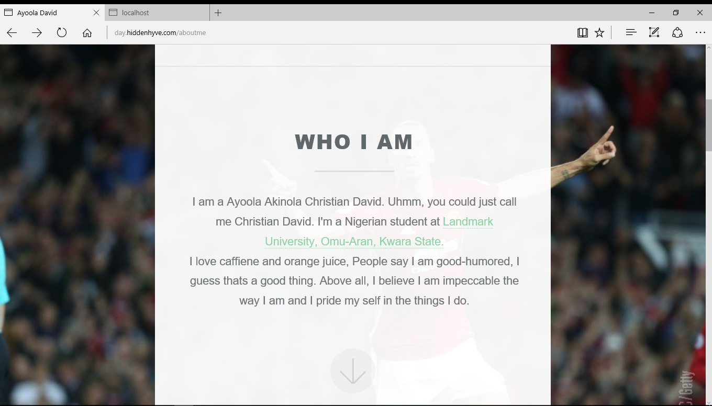
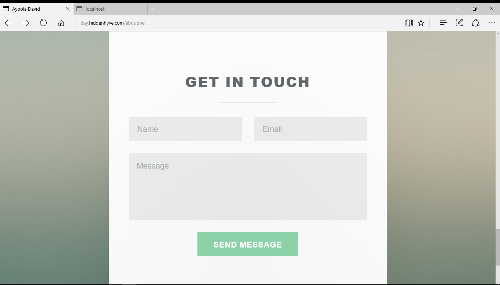
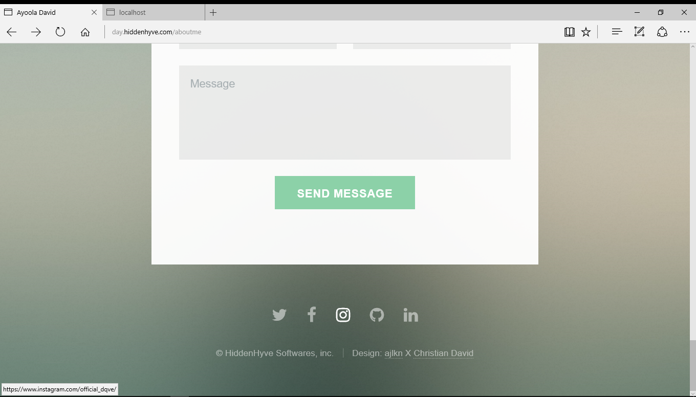
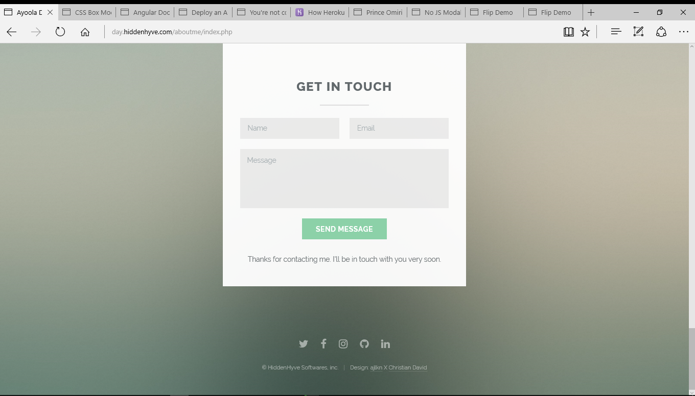

# day (David AYo)

This is a simple website that performs kind of like an introductory purpose for me, has a beautiful design and very responsive outlay and landing page. 
this is one of two, done in pure php, no added framework.
  
  
  
  
  
